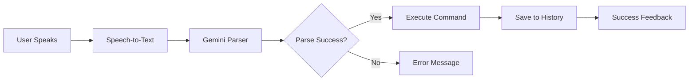

# Speak Spark Implementation Plan

Voice-controlled command interface that uses Gemini AI to translate spoken instructions into actions across other Sparks.

## User Review Required

> [!IMPORTANT]
> **New Dependency**: Requires Expo Speech Recognition (`expo-speech-recognition` or `@react-native-voice/voice`)
> 
> **Gemini API Usage**: Each voice command will make a Gemini API call for parsing

## Architecture

### Core Flow


### Components

#### 1. SpeakSpark.tsx (Main UI)
- Microphone button with animated listening state
- Processing indicator
- Success/error feedback
- Command history list with spark links

#### 2. VoiceCommandService.ts (New Service)
- Speech recognition initialization
- Audio recording management
- Transcription handling

#### 3. GeminiCommandParser.ts (New Service)
- Gemini API integration for command parsing
- Spark detection logic
- Command schema generation

#### 4. CommandExecutor.ts (New Service)
- Routes commands to target Sparks
- Executes actions (create todos, add weight, etc.)
- Returns execution results

#### 5. CommandHistory.ts (Storage)
- Persistent command history
- AsyncStorage backed
- Includes: timestamp, transcription, target spark, result

---

## Proposed Changes

### [NEW] Voice & AI Services

#### [NEW] [VoiceCommandService.ts](file:///Users/mattdyor/SparksApp/src/services/VoiceCommandService.ts)
Speech recognition service using Expo's speech APIs:
- `startListening()`: Begin recording
- `stopListening()`: End recording and get transcription
- `isAvailable()`: Check device support
- Error handling for permissions

#### [NEW] [GeminiCommandParser.ts](file:///Users/mattdyor/SparksApp/src/services/GeminiCommandParser.ts)
Gemini-powered command parser:
- `parseCommand(transcript: string)`: Returns parsed command object
- Prompt engineering for command interpretation
- Spark detection from keywords or explicit names
- Structured output schema:
  ```typescript
  {
    targetSpark: 'todo' | 'weight-tracker' | 'toview' | 'spanish-flashcards',
    action: 'create' | 'add' | 'open',
    params: {
      // Spark-specific parameters
    }
  }
  ```

#### [NEW] [CommandExecutor.ts](file:///Users/mattdyor/SparksApp/src/services/CommandExecutor.ts)
Routes and executes commands:
- `execute(parsedCommand)`: Calls appropriate Spark methods
- Integration with existing Spark storage services
- Returns success/failure status

---

### Spark-Specific Integrations

#### TodoSpark Integration
**Example**: "Add a todo in work for send the report to the boss"
- Parse: `{ category: 'work', text: 'send the report to the boss', dueDate: 'today' }`
- Execute: Create todo via `todoStore.addTodo()`

#### WeightTrackerSpark Integration
**Example**: "Register my weekly weight as 150"
- Parse: `{ weight: 150, unit: 'lbs', date: 'today' }`
- Execute: Add weight entry via `weightStore.addEntry()`

#### ToViewSpark Integration
**Example**: "Add the Movie the Recruit on Netflix to toview and watch it with Liz"
- Parse: `{ title: 'The Recruit', type: 'Movie', provider: 'Netflix', notes: 'Liz' }`
- Execute: Add item via `toviewStore.addItem()`

#### SpanishFlashcardSpark Integration
**Example**: "Open Spanish Flashcards in Auto Learn mode"
- Parse: `{ action: 'open', mode: 'autoLearn' }`
- Execute: Navigate to SpanishFlashcardSpark with mode param

---

### Main Spark Component

#### [NEW] [SpeakSpark.tsx](file:///Users/mattdyor/SparksApp/src/sparks/SpeakSpark.tsx)

**UI States**:
1. **Idle**: Large mic button
2. **Listening**: Animated pulsing mic, "Listening..." text
3. **Processing**: Loading spinner, "Processing command..."
4. **Success**: Checkmark, result message, link to target Spark
5. **Error**: Error icon, "Sorry - I was not able to understand that instruction. Try saying 'Add a todo for picking up the groceries'"

**History Section**:
- ScrollView of past commands
- Each item shows:
  - Transcribed text
  - Timestamp
  - Target Spark (tappable link)
  - Status icon (✓ or ✗)

**Permissions**:
- Request microphone permission on mount
- Helpful message if denied

---

### Storage Schema

#### [NEW] Command History Type
```typescript
interface VoiceCommand {
  id: string;
  timestamp: number;
  transcription: string;
  targetSpark: string;
  action: string;
  params: Record<string, any>;
  success: boolean;
  errorMessage?: string;
}
```

Storage key: `@speak-spark/command-history`

---

### Spark Registry Updates

#### [MODIFY] [SparkRegistry.tsx](file:///Users/mattdyor/SparksApp/src/components/SparkRegistry.tsx)
Add SpeakSpark entry:
```typescript
{
  id: 'speak-spark',
  name: 'Speak Spark',
  emoji: '🎤',
  description: 'Control other Sparks with your voice',
  color: '#8E44AD',
  component: SpeakSpark,
  category: 'productivity',
  isAvailable: true,
}
```

---

## Gemini Prompt Design

### System Prompt
```
You are a voice command parser for a mobile app called Sparks. 
Parse the user's spoken command and output JSON.

Available Sparks and their actions:
- TodoSpark: Create todos with category, text, dueDate
- WeightTrackerSpark: Add weight entries with weight, unit, date
- ToViewSpark: Add movies/shows with title, type, provider, notes
- SpanishFlashcardSpark: Open in specific mode (autoLearn, manual)

Output format:
{
  "targetSpark": "todo|weight-tracker|toview|spanish-flashcards",
  "action": "create|add|open",
  "params": { /* spark-specific */ },
  "confidence": 0.0-1.0
}

If confidence < 0.7, return { "error": "unclear" }
```

### Example Prompts & Responses
```json
// Input: "Add a todo in work for send the report to the boss"
{
  "targetSpark": "todo",
  "action": "create",
  "params": {
    "category": "work",
    "text": "send the report to the boss",
    "dueDate": "today"
  },
  "confidence": 0.95
}

// Input: "Register my weekly weight as 150"
{
  "targetSpark": "weight-tracker",
  "action": "add",
  "params": {
    "weight": 150,
    "unit": "lbs",
    "date": "today"
  },
  "confidence": 0.98
}
```

---

## Verification Plan

### Automated Tests
None initially (voice input is difficult to test automatically)

### Manual Verification
1. **Basic Flow**:
   - Tap mic button
   - Speak: "Add a todo for test command"
   - Verify: Todo created, appears in history, success message shown

2. **Each Supported Spark**:
   - TodoSpark: Create todo with category
   - WeightTrackerSpark: Add weight entry
   - ToViewSpark: Add movie with provider
   - SpanishFlashcardSpark: Open in Auto Learn mode

3. **Error Handling**:
   - Gibberish input → Error message shown
   - Microphone permission denied → Helpful error
   - Network failure → Error with retry option

4. **History**:
   - Execute 3-4 commands
   - Verify all appear in history
   - Tap spark link → Navigate to that Spark
   - Close and reopen app → History persists

5. **Edge Cases**:
   - Very long command
   - Command with multiple sparks mentioned
   - Ambiguous command ("add 150" without context)
