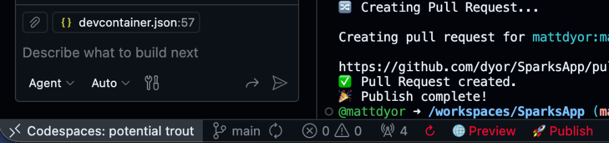

# SparksApp

SparksApp is a mobile application featuring a collection of micro-experiences ("sparks") - 30+ interactive, vibe-coded experiences like decision spinners, spanish flashcards, trip journal, and golf analyzer. You can either install the app for yourself at https://sparks.febak.com/check-out-the-sparks-app or create your own spark [down below 👇](https://github.com/dyor/SparksApp/blob/main/README.md#2-using-github-codespaces) 

# [Download the App](https://linkly.link/2TcvP)

## Features

*   **Modular "Sparks"**: 30+ vibe-coded sparks (basically mini apps) across multiple categories:
    *   **Productivity**: Speak Spark (Voice Control), Todo List, Packing List, Minute Minder, Trip Survey, Coming Up
    *   **Spanish**: Spanish Flashcards, Spanish Friend (Amigo), Spanish Reader
    *   **Media**: Toview (movies/books/shows), Short Saver (YouTube), Song Saver (Spotify), Sound Board
    *   **Golf**: Golf Brain, Tee Time Timer, Golf Wisdom
    *   **Health**: FoodCam, Weight Tracker, Final Clock
    *   **Utility**: Decision Spinner, Quick Convert, CardScore, Share Sparks
    *   **Travel**: TripStory, Trip Survey
    *   **Games**: Business Simulator, Buzzy Bingo
    *   **Community**: Spark Wizard (submit your own ideas)
*   **Marketplace**: Browse and manage your collection of Sparks.
*   **Theming**: Full dark/light mode support across all sparks.
*   **Persistence**: Data saved locally via AsyncStorage.
*   **Settings System**: Comprehensive settings for each spark with feedback integration.
*   **Cross-platform**: iOS, Android, and Web support via Expo.
> 

# Contributing New Sparks

We welcome contributions! There are three ways you can add new sparks to the app, ranging from a simple in-app wizard to full code contributions via GitHub.

## 1. Using the Spark Wizard (In-App)

The most user-friendly way to contribute is directly through the interface of the Sparks app.

1.  **Install the App:**
    - **Android:** [Google Play Store Listing ↗](https://play.google.com/store/apps/details?id=com.mattdyor.sparks)
    - **iOS:** [iOS App Store Listing ↗](https://apps.apple.com/us/app/get-sparks/id6752919846)
2.  **Open the Wizard:** Navigate to the **Spark Wizard** within the app.
3.  **Create:** Follow the step-by-step prompts to define your spark's content.
4.  **Submit:** Submit your spark for review directly through the app.

> **Note:** The Spark Wizard allows you to share.


## 2. Using GitHub Codespaces

Use a pre-configured cloud environment to add sparks via the codebase without any local setup.

# [Create Codespace]([https://linkly.link/2TcvP](https://github.com/codespaces/new?skip_quickstart=true&machine=standardLinux32gb&repo=1048220194&ref=main&devcontainer_path=.devcontainer%2Fdevcontainer.json&geo=UsWest))

1.  **Create a Codespace:** Head over to <a href="https://github.com/codespaces/new?skip_quickstart=true&machine=standardLinux32gb&repo=1048220194&ref=main&devcontainer_path=.devcontainer%2Fdevcontainer.json&geo=UsWest" target="_blank" rel="noopener noreferrer">Codespace Generation</a> to launch the environment.
2.  **Create a Branch:** Before making changes, create a new branch for your work (Codespaces start on `main` by default, and you don't have permission to push directly to main):
    ```bash
    git checkout -b my-spark-name
    ```
    Replace `my-spark-name` with a descriptive name for your spark (e.g., `hangman-game`, `new-todo-feature`).
3.  **Edit with Agent:** Use the built-in Copilot/AI agent to help generate or modify the spark files.
    - _Tip:_ You can tell the Agent to build a new spark based on an existing one but with the changes you want, and it will usually handle it with ease.
    - **Sample Prompt**: Try this example to build a Hangman game (copy the entire line):
      ```
      Build a Spark called Hangman. There are 2-4 players. The user will be asked how many players when they visit the spark. Once number of players has been selected say 'Hand the phone to Player 1 to enter the word' with an option to enter the word and click Start. Once Player 1 clicks Start then jump into the game by identifying the Player that is up, an ASCII art hangman structure, the number of letters presented as _, and all of the letters of the alphabet in little pill boxes. As the player pushes a letter, if it is present in the word draw it in, and if not draw the next piece of the hangman. Start by reviewing instructions in the AGENT.md file in the top directory.
      ```
4.  **Preview Your Change:** Click the **🌐 Preview** button (or use the "Start Expo Web" command) to start the Expo web server and preview the app in your browser.

    This will provide a web-based preview of the app so you can verify your spark looks correct.

5.  **Submit a PR:** Click the **🚀 Publish** button (or use the "Start Publish" command) to:
    - Stage all your changes
    - Commit them with a message
    - Push to your current branch
    - Create a Pull Request (PR) against the main repository

    **Note:** The Publish button creates a PR - it does not push directly to main. A Sparks administrator will review your PR and either publish your changes (so that they get picked up in the next Android and iOS release - usually once a week) or ask you for some follow-up modifications if needed.

**Note:** The Sparks Codespace has pre-configured controls at the bottom of the screen to help you preview changes (via a web page) and publish your changes (via a GitHub pull request or PR). 

> 

## 3. Forking the Repository

For developers who prefer a traditional Git workflow.

1.  **Fork the Repo:** Navigate to [dyor/SparksApp](https://github.com/dyor/SparksApp) and click **Fork** to create a copy under your account.
2.  **Make Changes:** Add your new spark files or edit an existing one within your fork.
3.  **Submit the Pull Request:**
    - Once your changes are pushed to your fork, go to the **Pull Requests** tab of the original `dyor/SparksApp` repository.
    - Click **New Pull Request** and then **"compare across forks"**.
    - Select your fork and branch, then click **Create Pull Request**.

> **Important Note:** Each PR should either improve a **single** existing Spark or create a **new** Spark. Changes spanning multiple Sparks will likely be rejected. If you are building a new Spark, it is fine to base it off an existing Spark (make it better). We look forward to seeing what you build!

**For detailed contribution guidelines, code style, and best practices, see [CONTRIBUTING.md](CONTRIBUTING.md).**

## Getting Started (if you decide to Fork)

### Prerequisites

- Node.js (v18+)
- npm or yarn
- Expo Go app on your mobile device (optional, for testing)

### Installation

1.  **Clone the repository**

    ```bash
    git clone https://github.com/dyor/SparksApp.git
    cd SparksApp
    ```

2.  **Install dependencies**

    ```bash
    npm install
    ```

3.  **Configure Environment Variables**

    - Create a `.env` file in the project root with your Firebase configuration:
      ```bash
      EXPO_PUBLIC_FIREBASE_API_KEY=your_api_key_here
      EXPO_PUBLIC_FIREBASE_AUTH_DOMAIN=your_project_id.firebaseapp.com
      EXPO_PUBLIC_FIREBASE_PROJECT_ID=your_project_id
      EXPO_PUBLIC_FIREBASE_STORAGE_BUCKET=your_project_id.firebasestorage.app
      EXPO_PUBLIC_FIREBASE_MESSAGING_SENDER_ID=your_sender_id
      EXPO_PUBLIC_FIREBASE_APP_ID=your_app_id
      EXPO_PUBLIC_FIREBASE_MEASUREMENT_ID=your_measurement_id
      ```
    - Get these values from Firebase Console (Project Settings > General > Your apps > Web app)
    - You will need to create a Firebase project and enable Firestore and Authentication (Anonymous).
    - **Important:** All Firebase environment variables must use the `EXPO_PUBLIC_` prefix.

4.  **Start the app**
    ```bash
    npx expo start
    ```
    - Scan the QR code with Expo Go (Android) or the Camera app (iOS).

## Project Structure

- `src/sparks/`: Individual Spark implementations.
- `src/components/`: Shared UI components.
- `src/services/`: Shared services (Firebase, Analytics).
- `src/screens/`: Main app screens (My Sparks, Marketplace).
- `src/types/`: TypeScript definitions.

## Contributing

We welcome contributions! Please see [CONTRIBUTING.md](CONTRIBUTING.md) for details on how to submit pull requests, report issues, and suggest improvements.

## License

This project is licensed under the MIT License - see the [LICENSE](LICENSE) file for details.
